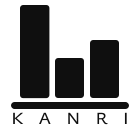

<p align="center">
    <picture>
        <source srcset="./Docs/images/kanri-light.svg" media="(prefers-color-scheme: light)" width="200" alt="logo dark theme">
        <source srcset="./Docs/images/kanri-light.svg" media="(prefers-color-scheme: dark)" width="200" alt="logo light theme">
        
    </picture>
</p>

<br/>

# 📊 Shō-Kanri API | Sample API based on the [_Kanri_](https://github.com/An-Ordinary-Software-Engineering/Kanri.Backend) project

> [!NOTE]\
> **Shō-Kanri** (or rather, _小規模な管理_ **Shōkibona Kanri**) comes from Japanese and means "small-scale management",
> because it is a small sample of the `@An-Ordinary-Software-Engineering/Kanri.Backend` project's API.

---

## Project Structure

```text
├───Docs/
├───Source/
│   ├───Shared/
│   │   ├───ShoKanri.Exception/
│   │   └───ShoKanri.Http/
│   ├───ShoKanri.API/
│   ├───ShoKanri.Application/
│   ├───ShoKanri.Domain/
│   └───ShoKanri.Infrastructure/
│
└───Test/
```

> This is the target structure of the project
